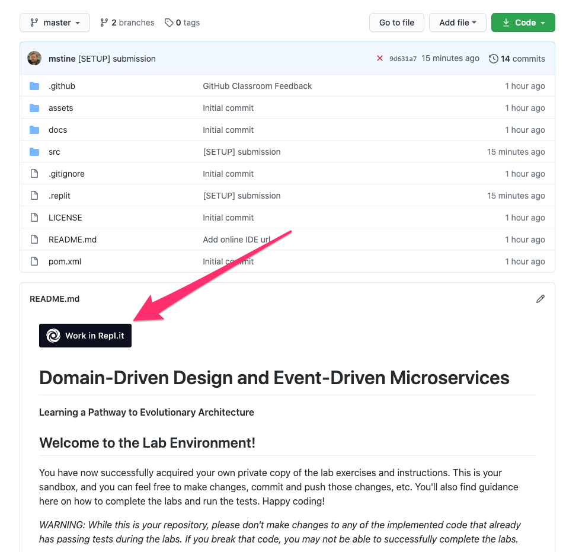
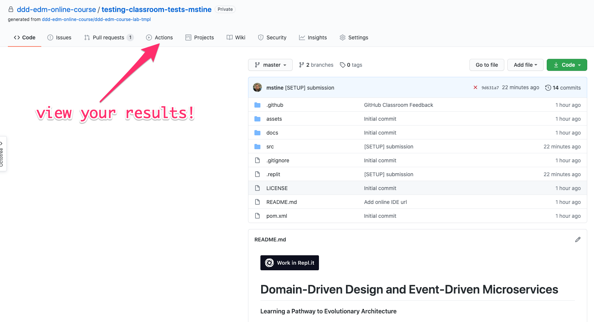
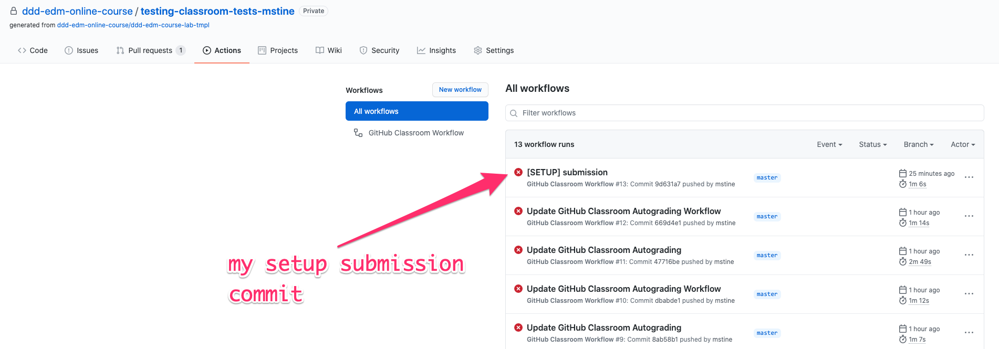
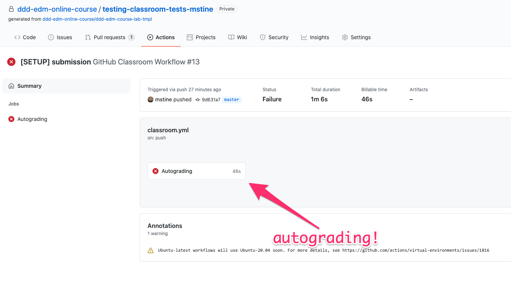

# Domain-Driven Design and Event-Driven Microservices

**Learning a Pathway to Evolutionary Architecture**

## Welcome to the Lab Environment!

You have now successfully acquired your own private copy of the lab exercises and instructions.
This is your sandbox, and you can feel free to make changes, commit and push those changes, etc.
You'll also find guidance here on how to complete the labs and run the tests. Happy coding!

_WARNING: While this is *your* repository, please don't make changes to any of the implemented code that already has passing tests during the labs.
If you break that code, you may not be able to successfully complete the labs._

## Setup Guide

If you've gotten this far, we can safely assume that your Git/GitHub setup is correct.
All that remains is to import the code into your IDE of choice and run your first tests.

You also have the choice of working on the labs within a browser-based IDE environment
called [Repl.it](https://repl.it). If you would like to do this, just click on the "Work in Repl.it" button
at the top of this README document. If this button is not present, it's possible that GitHub
Classroom has not finished configuring your repo. Just wait a moment and refresh the browser.

When you enter the Repl.it IDE, it will look similar to below. You can click the "Run" button to execute your
first tests, and you can use the Version Control icon to perform your commits. You also have a shell
tab that will allow you to run basic UNIX commands.

_NOTE: While IDE choice should not matter, these instructions have only been tested in IntelliJ IDEA._

1. Ensure your workstation has a proper Java 11 installation.

1. You will need to make sure your IDE is properly configured for Lombok.
At the following links, you can find instructions for [Eclipse](https://projectlombok.org/setup/eclipse) and [IntelliJ](https://projectlombok.org/setup/intellij) IDEA.

1. Import `pom.xml` as a Maven project into your IDE.

1. Run `com.mattstine.dddworkshop.pizzashop.suites.SetupSuite` to demonstrate that all the implemented tests are passing.

1. Assuming you've gotten this far, you're ready to submit your setup lab. Read on!

## Lab Submission Guide

Now we'll ensure that you are properly setup for submitting completed labs and viewing your results in GitHub.

_NOTE: While submission of your lab implementations is entirely optional, it will help your instructor gauge everyone's progress, as well as provide him the opportunity to provide custom feedback in your repository!_

1. Find `com.mattstine.lab.setup.HelloWorldTest`. This test should currently be failing.

1. Make it pass!

1. You'll now want to commit your changes to Git. When submitting labs, please prefix your commit with `[NAME OF LAB]` in order to make it easier to track down.
For this lab, you'll prefix with `[SETUP]`. For Lab 1, you'll prefix with `[LAB 1]`. And so on...

1. Push your changes to GitHub.

1. GitHub Classroom has configured your repository to "autograde" your submissions. You can view the progress of
   this autograding by clicking on "Actions":

    

   followed by the commit you want to view:

   

   and then "Autograding":

   

   GitHub will grade *ALL* of the labs each time you submit, so don't be alarmed by the failures. For your Setup Submission, if you
   search the output for "Setup Lab" you should find a green checkmark.
   
   

1. Finally, if you click on "Pull requests," you wil find a single PR entitled "Feedback." This PR will allow me to provide
   you with feedback on your work. For example, if you run into test failures that you do not understand, just
   go ahead and commit/push that code, then contact me in the private chat window. I can then take a look at your code and
   provide you with feedback on the commit.

1. Assuming you've gotten this far, you're ready to start Lab 1!

## Lab Guides

* [Lab 1](docs/lab1.adoc) - TDD Aggregate Root - Create Kitchen Commands with Business Logic and Invariants
* [Lab 2](docs/lab2.adoc) - TDD Aggregate Root - Create and Publish Kitchen Domain Events
* [Lab 3](docs/lab3.adoc) - TDD Aggregate Repository - Create Kitchen Repositories and Add Domain Events
* [Lab 4](docs/lab4.adoc) - TDD Aggregate Repository - Rehydrate Kitchen Aggregates by Reference
* [Lab 5](docs/lab5.adoc) - TDD Policy - Subscribe to a Kitchen Domain Event from within an Aggregate and Create CQRS View
* [Lab 6](docs/lab6.adoc) - TDD Application Service - Expose Kitchen Business Interface and Implement Transactions
* [Lab 7](docs/lab7.adoc) - TDD Policy - Subscribe to a Kitchen Domain Event from an Adjacent Aggregate and Update State
